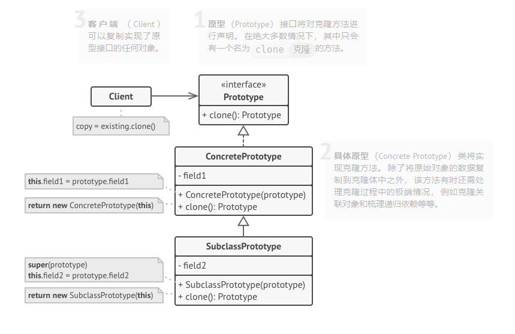

> 参考自[《设计模式》](https://refactoringguru.cn/design-patterns)，[dunwu的博客](https://dunwu.github.io/design)

## 常见的UML类图表达 

|连接点\连接线| 实线| 虚线|
|---|---|---|
|空心箭头|继承|实现接口|
|实线箭头|关联|依赖|

|-\连接点|空心|实心|
|---|---|---|
|菱形实线箭头|聚合|组合|

## 面向对象原则
### 单一职责原则
单一职责原则（Single Responsibility Principle），应该有且仅有一个原因引起类的变更。

简单点说，一个类，最好只负责一件事。

### 开放-封闭原则
开放-封闭原则（Open Close Principle），软件实体（类、模块、函数）等应该可以扩展，但是不可修改。

对于扩展是开放的；对于更改是封闭的。

### 里氏替换原则
里氏替换原则（Liskov Substitution Principle），子类可以替换父类。

### 依赖倒置原则
依赖倒置原则（Dependency Inversion Principle），抽象不应该依赖于细节，细节应当依赖于抽象。换言之，要针对接口编程，而不是针对实现编程。

关键点：

高层模块不应该依赖低层模块，两者都应该依赖其抽象
抽象不应该依赖细节
细节应该依赖抽象
#接口隔离原则
接口隔离原则（Interface Segregation Principle）使用多个专门的接口，而不使用单一的总接口，即客户端不应该依赖那些它不需要的接口。

客户端不应依赖它不需要的接口
类间的依赖关系应该建立在最小的接口上
### 迪米特原则
迪米特原则（Least Knowledge Principle）又称最少知识原则，一个软件实体应当尽可能少地与其他实体发生相互作用。

一个类应该对自己需要调用的类知道得最少，类的内部如何实现、如何复杂都与调用者或者依赖者没关系，调用者或者依赖者只需要知道他需要的方法即可，其他的我一概不关心。

## 设计模式
### 创建型模式
创建型模式提供了创建对象的机制，抽象了`实例化`的过程， 能够提升已有代码的灵活性和可复用性。  
创建型模式的`指导思想`是：
- 将系统使用的具体类封装起来。
- 隐藏这些具体类的实例创建和结合的方式。
#### 工厂方法模式（factory method）

#### 抽象工厂模式（abstract factory）
 
 #### 生成器模式（builder）

1.建造者 （Builder） 接口声明在所有类型建造者中通用的产品构造步骤。  
2.具体建造者 （Concrete Builders） 提供构造过程的不同实现。 具体建造者也可以构造不遵循通用接口的产品。  
3.产品 （Products） 是最终生成的对象。 由不同建造者构造的产品无需属于同一类层次结构或接口。  
4.主管 （Director） 类定义调用构造步骤的顺序， 这样你就可以创建和复用特定的产品配置。  
5.客户端 （Client） 必须将某个建造者对象与主管类关联。 一般情况下， 你只需通过主管类构造函数的参数进行一次性关联即可。 此后主管类就能使用建造者对象完成后续所有的构造任务。 但在客户端将建造者对象传递给主管类制造方法时还有另一种方式。 在这种情况下， 你在使用主管类生产产品时每次都可以使用不同的建造者。
#### 原型模式（prototype）

原型模式将克隆过程委派给被克隆的实际对象。   
模式为所有支持克隆的对象声明了一个通用接口， 该接口让你能够克隆对象， 同时又无需将代码和对象所属类耦合。   
通常情况下， 这样的接口中仅包含一个 克隆方法。  
#### 单例模式 （single）

### 结构型模式
#### 适配器模式（adapter）

#### 桥接模式（bridge）

### 行为型模式
#### 策略模式（strategy）

可以定义一系列算法，分别导入到不同的类中，已使不同的算法能够，使得相同的行为可以有不同的实现方式。
#### 责任链模式（chain of responsibility）

收到请求后，可以选择处理或者转发给下一个处理者，并沿着这条链传递改请求，直到有一个对象处理它为止。

